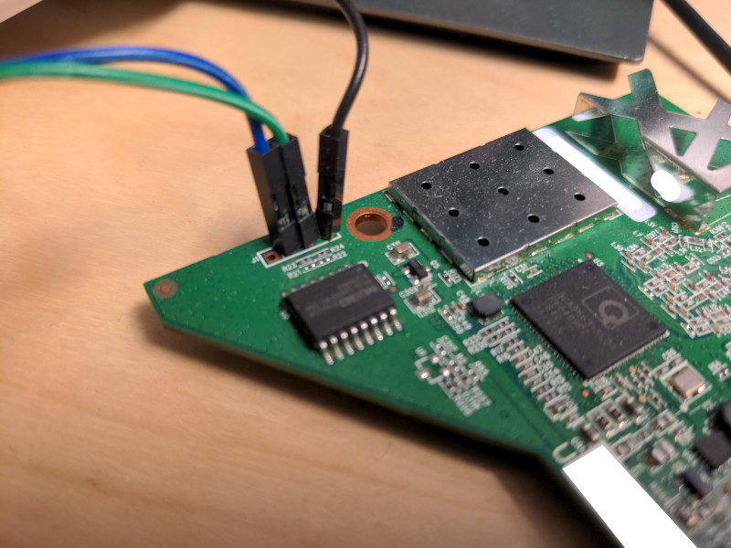

# Simple Nix-based OS for Unifi AP (AC-Lite)

Playing around with nixpkgs's cross-compilation support.

## Status

- Linux boots!
- Just an initramfs for the filesystem.
- Ethernet works in Linux.
- WiFi probably should work, but I haven't managed to configure hostapd right yet.

## How to use

You need:
- A Unifi AP AC-Lite and its PoE injector
- An Ethernet port available on your workstation
- Two Ethernet cables
- A USB-UART adapter and some wires to connect it

(you may want to skip ahead and start the build before proceeding, as the first build may take a while).

Crack open the AP's case. This model isn't held together by screws,
only plastic snap-in latch thingies. You should see two sets of holes
which look like they could be serial ports. You'll want the one close
to the metal can.

Connect the serial port to your adapter:

- device ground to adapter ground (black in my picture)
- device TX to adapter RX (green in my picture)
- device RX to adapter TX (blue in my picture)


Sorry for the potato image quality. The important part should be visible though.

Also connect an Ethernet cable from your workstation to the LAN port
on the PoE injector, and another from the injector's POE port to the
device. Don't connect the injector to mains power yet!

Configure a static IPv4 address on the interface, e.g. on NixOS:

```nix
{
  networking.interfaces.enp5s0.ipv4.addresses = [{ address = "192.168.99.1"; prefixLength = 24; }];
}
```

Then prepare the boot images, open the firewall, and start the TFTP server:

```
mkdir -p tftp
nix-build -A boot -o tftp/boot
sudo iptables -I INPUT 1 -d 192.168.99.1 -p udp --dport 69 -j ACCEPT
sudo nix-shell -p atftp --run 'atftpd --daemon --logfile - --no-fork ./tftp'
```

Open up your serial console, for example with `picocom -b 115200 /dev/ttyUSB0`.

Then power on your UAP-AC-LITE, interrupt the boot timeout, and perform some initial setup when the `ath>` prompt appears.

⚠️ This will prevent booting the original firmware automatically! ⚠️
```
ath> set bootcmd_ubnt $bootcmd
ath> set ipaddr 192.168.99.2
ath> set serverip 192.168.99.1
ath> set fetchcmd tftpboot 0x84000000 kernel.img && tftpboot 0x84ffffc0 initramfs.img
ath> set bootcmd run fetchcmd && bootm 0x84000000 0x84ffffc0
ath> set bootdelay 5
ath> saveenv
ath> boot
```

From then on, the AP should try to fetch and boot kernel and initramfs
from your workstation instead of booting the built-in firmware. This
allows for a fairly fast development cycle.

## Todos and ideas for the future

- ✅ Get WiFi working
- Add dropbear to the image
- Compare and contrast with [nixwrt](https://github.com/telent/nixwrt) to see if this is worth adapting to that structure
- Same thing but for [celun](https://github.com/celun/celun)
- Flashable images?
